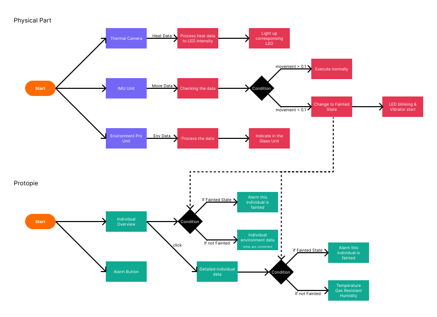
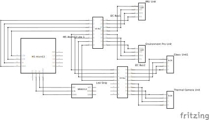
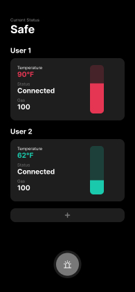
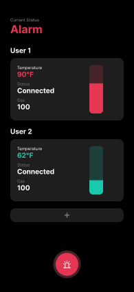
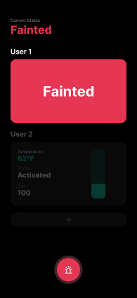
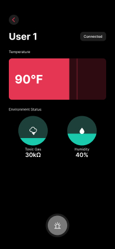

# Advance Prototype Final
**Xianghan Zeng | Advance-Prototype | SP 25**
## About this project
In the scenario of fire scene, people will get panic and urge to get out. In this situation, some important information like hidden fire soure and toxic gas. This project is a smart fire mask which aim to help user gather those important information to help user to avoid those danger through wearable device. For the physical part, it is using M5Stack with ATOM S3 as core to build up the wearable device. Also, an app is built to connect to the device to get the surrounding information from the mask.
## Hardware
### Exterior
Thermal Camera
Environmen Pro Unit
### Interior
Digital RGB LED

IMU Pro Unit

All the other electronics

## State Diagram

## Wiring Diagram


## Firmware
The code is devided into 3 parts which are check if fainted, processing thermal data, and demonstrating on the OLED.
### Checking Movement
The following code is checking the movement intensity of the mask is over a certain amount. If it is over, it means the user is awake. If it is below for more than 5 seconds, the code will mark the user as fainted until it start moving again.
``` Python  
    imu_val = imu.get_accelerometer()
    for i in range(3):
        if abs(imu_val[i] - imu_last[i]) < 0.1:
            faintcount += 1
        else:
            faint = False
    if faintcount >= 3 and faint == False:
        faint = True
        fainttime = time()
        faintcount = 0
    
    if faint == True:
        if time() - fainttime> 5:
            print('faint||'+ 'fainted')
            vibrator.once(freq=100, duty=10, duration=50)
    else:
        print('faint||'+ 'normal')
        
    imu_last = imu_val
```

### Processing Thermal Camera Heat Data
The following code is a function to help categorize the heat data from a 32 x 24 thermal camera. Since the LED is placed around the edge of the mask, the heat data need to transform from a matrix to temperature with directions.
``` Python  
    def calDir(width,height):
    cx = (width - 1) / 2
    cy = (height - 1) / 2
    temp_data = []
    for y in range(height):
        for x in range(width):
            temp_data.append(thermal.get_pixel_temperature(x,y))
            dx = x - cx
            dy = y - cy
            theta = math.atan2(dy, dx)
            deg = (math.degrees(theta) + 360) % 360
            startAngle = (262.5 - deg + 360) % 360
            
            if startAngle < 345:
                index = int(startAngle / sector)
                led_pixels[index].append(thermal.get_pixel_temperature(x,y))
```
This part is for implementing the heat data onto the LED strip in the mask.
``` Python
    for sublist in led_pixels:
        sublist.clear()
    calDir(32,24)
    for i in range(30):
        if led_pixels[i]:
            max_temp = max(led_pixels[i])
        max_temp = int(((max_temp)-20)*10)
        if max_temp > 255:
            max_temp = 255
        if max_temp < 0:
            max_temp = 0
        np[i] = (max_temp,30-max_temp,0)
    np.write()     
    thermal.update_temperature_buffer()
    if faint == True:
        blink = np
        for i in range(30):
            np[i] = (0,0,0)
        np.write()
        for i in range(30):
            np[i] = blink[i]
        np.write
```

### Processing Thermal Camera Heat Data
This part of the code is getting environment data from the environment pro unit.
``` Python
    #check environment status
    env_val[0] = envpro.get_temperature()
    env_val[1] = envpro.get_humidity()
    env_val[2] = envpro.get_gas_resistance()

    glass.clear()
    Widgets.Label("Temp", 10, 10, 1.0, 0xffffff, 0x222222, Widgets.FONTS.DejaVu9, glass)
    Widgets.Label(str(int(env_val[0])), 80, 10, 1.0, 0xffffff, 0x222222, Widgets.FONTS.DejaVu9, glass)
    Widgets.Label("Gas", 10, 20, 1.0, 0xffffff, 0x222222, Widgets.FONTS.DejaVu9, glass)
    Widgets.Label(str(int(env_val[2])), 80, 20, 1.0, 0xffffff, 0x222222, Widgets.FONTS.DejaVu9, glass)
    Widgets.Label("Humid", 10, 30, 1.0, 0xffffff, 0x222222, Widgets.FONTS.DejaVu9, glass)
    Widgets.Label(str(int(env_val[1])), 80, 30, 1.0, 0xffffff, 0x222222, Widgets.FONTS.DejaVu9, glass)
    #check remaining oxygen
    print('temp||'+ str(int(env_val[0])))
    print('gas||'+ str(int(env_val[1])))
    print('humid||'+ str(int(env_val[2])))
```
## Software
Here is the application I built for see the information of the mask. The app is designed for user whoe is in charge of taking the lead such as the firefighter captain and the adult in the family.

In the first page, the user can see the key data(temperature, connection state, and gas resistance) from different mask connected to the app with a temperature indicator at the side.
At the bottom, there is a alarm button that user can use it to set an alarm and call 911 for help.
When anyone wearing the mask is marked as fainted, it will also be marked as fainted in the app.

 



When user click on the individual card, user will go into the detailed page with more information about the mask wearer.
Also in this page if the person who is wearing marked as fainted, the page will turn red to indicate it is fainted.




## Materials
This project utilize the following hardware devices and materials to build
* M5 ATOM S3
* ATOMIC PORTABC EXTENSION BASE
* INFRARED REFLETIVE SENSOR UNIT
* 6-DOF IMU PRO MINI UNIT
* GROVE CABLE
* USB TYPE C TO C CABLE
* DIGITAL RGB LED
* Full face Respirator
* Unit Glass
* 1 TO 3 HUB GROVE EXPANSION UNIT
* GROVE-T CONNECTOR
* ENV PRO UNIT
* Thread
* White Arcrylic Board

## Integrations
Here is how I set up in firmware to connect to the protopie
Here is how I set up in protopie to recieve information from the hardware devices
## Project Outcome
### Video of physical outcome
[video link](AP_assignment-4_physical_outcome_demonstration.mp4)
### Video of protopie
[video link](AP_Assignment-4_prototype_demonstration.mp4)

## Code file
[Final code file](final.py)

## Conclusion

## Reference
Here are the reference I took during the process of creating this project