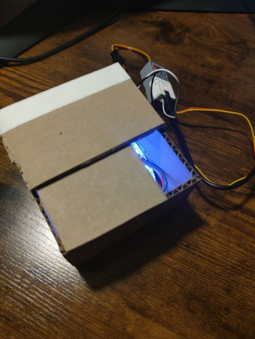
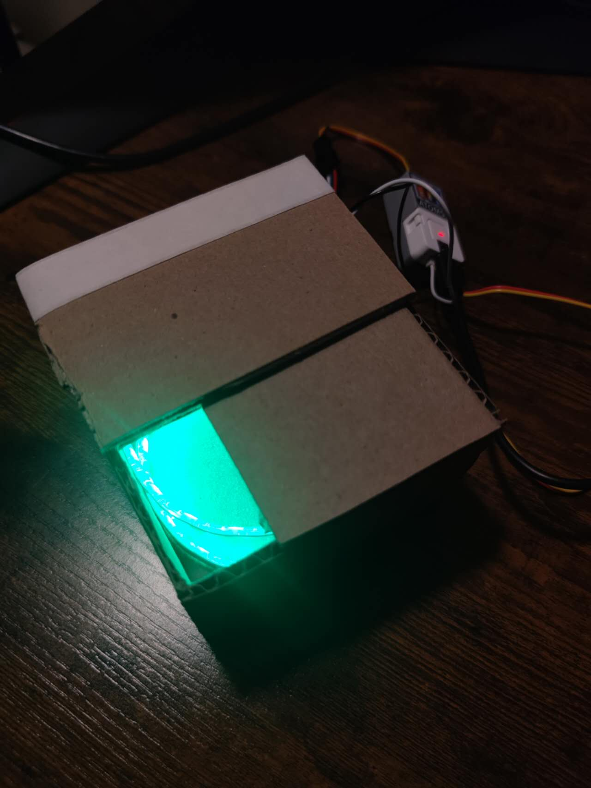

# Assignment 3
**Xianghan Zeng | Advance-Prototype | SP 25**\
## About this project
This project is using ATOM S3 to create an installation with different LED affect.
## Explaining the code
This code have one part for detecting the stage of the physical conenction and changing the state and another part executing different code for different state.
### Code for detecting
The following code is the detecting if the button changes and change the state.
``` Python  
    if btn.value() == 1:    # detecting the input from button
        program_state = 'disconnect'
    elif btn.value() == 0:  # if the button is connected
        if btn_val_last == 1:   # detect one time if the button changes 
            program_state = 'starting'
            startTime = time() * 1000   # start timer
        else:
            if (time()*1000) - startTime > 5000:    # if time is over 5 second
                program_state = 'finishing'
    btn_val_last = btn.value()
```
\
The following code is executing different LED affect for different state.
* If the button is disconnected, the LED will blink with white light.
``` Python  
    if program_state == 'disconnect':
        for g in range(150):
            for i in range(30):
                np[i] = (g, g, g)
            np.write()
            sleep_ms(1)
            if btn.value() == 0:    # change the state if button disconnected
                for i in range(30):
                    np[i] = (0, 0, 0)
                np.write()
                break
        for g in range(150):
            for i in range(30):
                np[i] = (150-g, 150-g, 150-g)
            np.write()
            sleep_ms(1)
            if btn.value() == 0:    # change the state if button disconnected
                for i in range(30):
                    np[i] = (0, 0, 0)
                np.write()
                break
```
* If the button is connected, the LED will gradually one by one light up with green light
``` Python
    if program_state == 'starting':
        for i in range(30):
            for g in range(50):
                np[i] = (0,g*4,0)
                sleep_ms(1)
                np.write()
            if btn.value() == 1:
                for i in range(30):
                    np[i] = (0, 0, 0)
                np.write()
                break
```
* After 5 seconds connecting the button, the LED will slowly change to yellow light
``` Python
    if program_state == 'finishing':
        if np[0][0] < 190:
            for g in range(200):
                for i in range(30):
                    np[i] = (g,np[i][1],0)
                np.write()
            sleep_ms(1)
```
## Hardware & connection
This project utilize the following hardware devices and materials to build
* M5 ATOM S3
* ATOMIC PORTABC EXTENSION BASE
* GROVE CABLE
* USB TYPE C TO C CABLE
* DIGITAL RGB LED
* Cardboard
* Copper Tape
* Tape
* Glue
\The M5 ATOM S3 is attached on the ATOMIC PORTABC EXTENSION BASE connecting to DIGITAL RGB LED and a GROVE CABLE. I use cardboad and glue to build a box with an openning and a cover of the opening that could slide to left and right. The GROVE CABLE is cut in half and attached to two different copper tape and place on the box and the button of the slide cover. The led strip is place into the box. By swipping the slide cover, the copper tape will be connected or diconnected and triggering the state change in the code causing the LED light change.

## Physical outcome
### Stage with button disconnected

### Stage with button connected

### Stage with button connected after 5 seconds


## Code file
[Assignment 3 code file](assignment_3.py)
