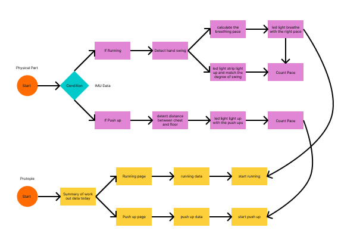

# Assignment 4
**Xianghan Zeng | Advance-Prototype | SP 25**\
## About this project
This project is using ATOM S3 to create wearable device for running and pushups.
## Explaining the code
This code have one part for detecting the stage of the physical conenction and changing the state and another part executing different code for different state.
### Code for detecting
The following code is the detecting if the button is pressed and change the state.
``` Python  
    if btn.value() == 0 and btn_last != btn.value():
        if programstate == 'pushup'or programstate == '':
            programstate = 'running'
            runningtime = time()
            print('programstate||'+ '1')
        else:
            programstate = 'pushup'
            pushuptime = time()
            print('programstate||'+ '2')
    
    btn_last = btn.value()
```
\
The following code is used for detecting the movement of the arm to count the running pace.
* If the arm move fast, the acceloration will be detected and counted as a pace.
``` Python  
    dx = abs(imu_val[0])
    # check if the IMU acceloration is high
    if (dx > 1.5):
        numlight = getNumMap(dx)
        if numlight > numlight_last:
            numlight_last = numlight
        elif numlight < numlight_last:
            if numlight_last > peek:
                peek = numlight_last
                countpeek += 1
                pace += 1
            numlight_last = numlight
    # reset peek
    if dx < 1:
        peek = 0
```
This part is for calculating the breathing time for the runner to follow.
``` Python
    # calculating breathing time
    if breathecheck == False:
        startbreathe = time_ns()
        breathecheck = True
    if breathecheck == True:
        if countpeek == 2:
            breathetime = int((time_ns() - startbreathe) / 1000000)
            breathecheck = False
            countpeek = 0
            if breathetime > 500:
    #           print(breathetime)
                speed = 4 * 2000 / breathetime
    # limit the breathe speed
    if speed < 4:
        speed = 4
    if speed > 12:
        speed = 12
```
This part create and execute the breathing effect based on the calculation.
``` Python
    # create breathing effect
    if countg >= 160 and state == 'in':
        state = 'ex'
        counttime = time()*1000 - start
        start = time() * 1000
    if countg <= 10 and state == 'ex':
        state = 'in'
        counttime = time()*1000 - start
        start = time() * 1000
    
    for i in range(30):
        if i < numlight:
            np[i] = (0,int(countg),0)
        else:
            np[i] = (0,0,0)
    np.write()
    
    if state == 'in':
        countg += speed
    if state == 'ex':
        countg -= speed
```
This part send data to protopie.
``` Python
    # send data to protopie
    print('pace||'+str(pace))
    print('breathe||'+str(int((countg-10)/1.5)))
    print('runtime||'+str((time() - runningtime)/60))
```
This part is for counting pushups and sending data to protopie.
``` Python
    # pushup state
    if programstate == 'pushup':
        r_val = reflect.get_analog_value()
        if r_val > 56000:
            r_val = 56000
        # activate when hand is facing down
        if imu_val[2] > 0.5:
            # count the pushups
            if r_val < 50000:
                if pushupcheck == False:
                    pushup += 1
                    pushupcheck = True
            if pushupcheck == True and r_val > 52000:
                pushupcheck = False
        # send data to protopie
        print('pushup||'+str(pushup))
        print('pushuploca||'+str(int((r_val-40000)/60)))
        print('pushuptime||'+str((time() - pushuptime)/60))
```
## Hardware
This project utilize the following hardware devices and materials to build
* M5 ATOM S3
* ATOMIC PORTABC EXTENSION BASE
* INFRARED REFLETIVE SENSOR UNIT
* 6-DOF IMU PRO MINI UNIT
* GROVE CABLE
* USB TYPE C TO C CABLE
* DIGITAL RGB LED
* Cardboard
* A pair of sports glove
* A long sleeve shirt
* Velcro
* Glue

## Connection
The M5 ATOM S3 is attached on the ATOMIC PORTABC EXTENSION BASE connecting to DIGITAL RGB LED, IMU pro Unit, and a Reflective IR Unit. The IMU pro Unit is attached to the sports glove by Velcro to detect hand movement. The ATOM S3 and Reflective IR Unit is attached to the long sleeve shirt for changing mode and detecting distance to the ground. The LED light strip is palced in a carboard box like the handle of the treadmill to showcase the movement.

## Outcome
### Flow state

### Video of physical outcome
[video link](AP_assignment-4_physical_outcome_demonstration.mp4)
### Video of protopie connection
[video link](https://drive.google.com/file/d/1sr0mjs_IC40tgMhjn8MdKwlhwTBGLLNr/view?usp=sharing)

## Code file
[Assignment 4 code file](assignment_4.py)